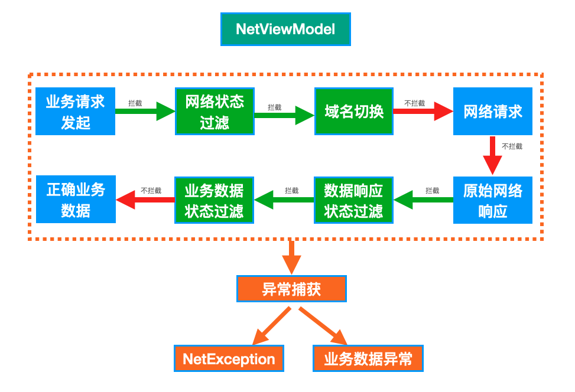

# NET Library

基于kotlin+协程封装的网络请求库。结合NetViewModel获取请求状态监听，状态判断。分层处理业务数据。


核心功能：

* 1.service快速创建（带缓存）
* 2.NetViewModel，网络状态拦截，数据状态拦截，异常捕获 
* 3.动态切换域名

功能结构图：

 

基于场景的特殊性，可单独展示的API非常少，建议直接查看应用示范代码

NetViewModel 详细使用请参考 `HomeVM`类

域名切换源码为开源库`RetrofitUrlManager`，[点击直达源码仓库](https://github.com/JessYanCoding/RetrofitUrlManager/blob/master/README-zh.md)

## 简单介绍：

## 一、初始化

```kotlin
        val okHttpClient =  OkHttpClient.Builder().addDynamicDomainSkill()
            .build()
        val retrofit = Retrofit.Builder()
            .client( okHttpClient)
            .baseUrl("https://www.xx.com")
            .build()
        NetManager.init(retrofit,application,BuildConfig.DEBUG)
```

## 二、NetViewModle中使用

```kotlin
        netLaunch({
            val data = withBusiness {
                homeRepo.homeApi.getBanner()
            }
            _bannerData.value = data
        }, WanAndroidNetStateHandler(true, _loadEventLiveData), "加载 banner")

```